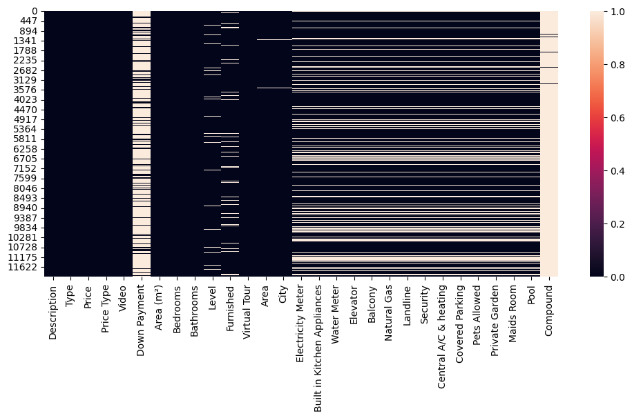
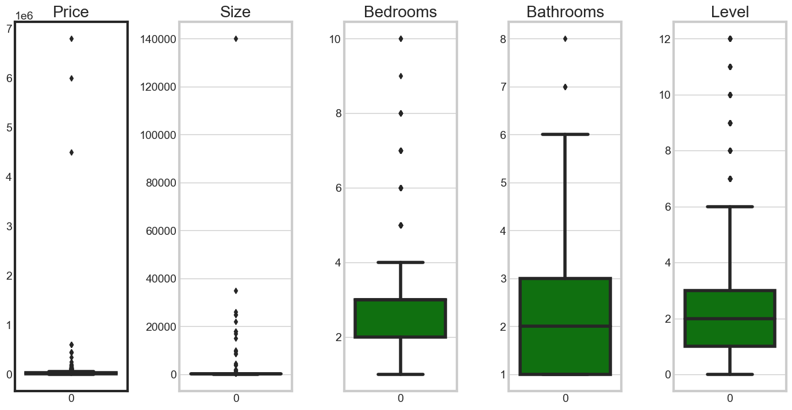
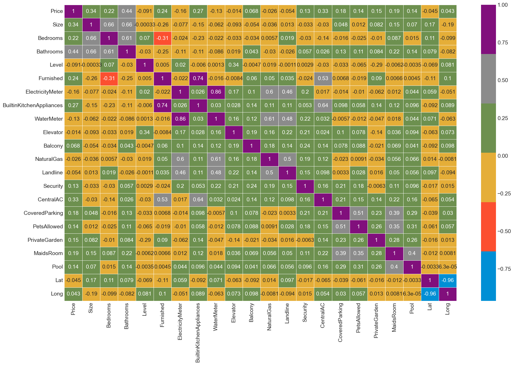
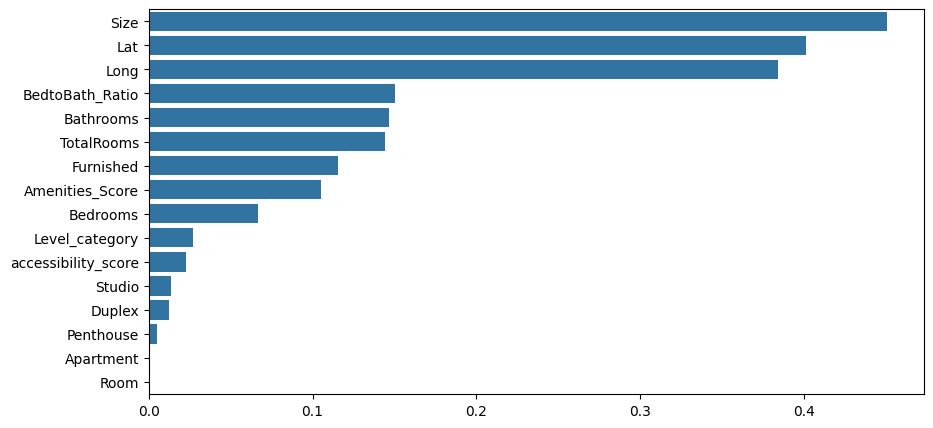

# Cairo Houses Rent Prices

*Wordcloud from the description of some posted ads (check EDA notebook).*


[](https://www.kaggle.com/datasets/mu6tf2/egypt-housing-rent)
[](https://colab.research.google.com/drive/1oVTiayrMQpsYrf07b4SRTgjWwv2anMX3?usp=sharing)


Complete Analysis for Rent housing prices in Egypt (Cairo & Giza).

## Auther
[@mu57f4](https://github.com/mu57f4)

## Table of Content
  - [Problem Statement](#Problem-statement)
  - [Dataset](#data-collection)
  - [Cleaning Process](#cleaning-process)
  - [Location Geo Coding](#location-geocoding)
  - [EDA](#EDA)
  - [Machine Learning Preprocessing](#ml-preprocessing)
  - [Model Selection](#Model-Selection)
  - [Model Training](#Model-Training)
  - [Evaluation](#Evaluation)
  - [Feature Importance and Insights](#Feature-Importance-and-Insights)
  - [Deployment](#Deployment)
  - [Limitations and Possible Improvmentsx](#Limitations-and-Possible-Improvments)
  

## Dataset
Data sources:
- From [dubizzle.com.eg](https://dubizzle.com.eg), check the scripts used in [notebooks](/notebooks/)

Some information about the dataset:
```
<class 'pandas.core.frame.DataFrame'>
RangeIndex: 12066 entries, 0 to 12065
Data columns (total 29 columns):
 #   Column                       Non-Null Count  Dtype 
---  ------                       --------------  ----- 
 0   Description                  12066 non-null  object
 1   Type                         12066 non-null  object
 2   Price                        12066 non-null  object
 3   Price Type                   12066 non-null  object
 4   Video                        12066 non-null  object
 5   Down Payment                 2697 non-null   object
 6   Area (m²)                    12066 non-null  object
 7   Bedrooms                     12066 non-null  object
 8   Bathrooms                    12066 non-null  int64 
 9   Level                        11499 non-null  object
 10  Furnished                    10792 non-null  object
 11  Virtual Tour                 12066 non-null  object
 12  Area                         12026 non-null  object
 13  City                         12026 non-null  object
 14  Electricity Meter            9252 non-null   object
 15  Built in Kitchen Appliances  9252 non-null   object
 16  Water Meter                  9252 non-null   object
 17  Elevator                     9252 non-null   object
 18  Balcony                      9252 non-null   object
 19  Natural Gas                  9252 non-null   object
 20  Landline                     9252 non-null   object
 21  Security                     9252 non-null   object
 22  Central A/C & heating        9252 non-null   object
 23  Covered Parking              9252 non-null   object
 24  Pets Allowed                 9252 non-null   object
 25  Private Garden               9252 non-null   object
 26  Maids Room                   9252 non-null   object
 27  Pool                         9252 non-null   object
 28  Compound                     151 non-null    object
dtypes: int64(1), object(28)
memory usage: 2.7+ MB
```
### columns information:
#### Main Features:
1. `Description`: (Text) House description in the posted ad.
2. `Type`: (Categorical) Type of the house e.g. Apartment, Town House, etc...
3. `Price`: (Continuous) Price in Egyptian pound (EGP).
4. `Price Type`: (Binary) Negotiable price or not
5. `Video`: (Binary) Video of the house
6. `Down Payment`: (Continuous) deposit of the house, usually a month rent
7. `Area (m²)`: (Continuous) Size of the house in sq. meter.
8. `Bedrooms`: (Discrete) Number of bedrooms.
9. `Bathrooms`: (Discrete) Number of bathrooms.
10. `Level`: (Discrete) Level of floor e.g. Ground, 1st, etc...
11. `Furnished`: (Binary) The house furnished or not?
12. `Virtual Tour`: (Binary) Virtual tour for the house.
13. `Area`: (Categorical) The area where the house alocated in the city.
14. `City`: (Categorical) City of the house.
#### Amenities Columns: (Binary)
15. `Electricity Meter`
16. `Built in Kitchen Appliances`
17. `Water Meter`
18. `Elevator`
19. `Balcony`
20. `Natural Gas`
21. `Landline`
22. `Security`
23. `Central A/C & heating`
24. `Covered Parking`
25. `Pets Allowed`
26. `Private Garden`
27. `Maids Room`
28. `Pool`
29. `Compound`

## Cleaning Process


Here is the cleaning process:
1. Clean continuous columns.
2. Clean categorical columns.
3. Encode the boolean/categorical columns.
2. Impute the missing values.

### Missing Values
- First remove the `Description` column from the dataset.
- Encode all the categorical columns.
- Use sklearn `IterativeImputer` to fill the Null values.
- Return the categorical columns into it's original values.

### Using scikit-learn `IterativeImputer`

It uses machine learning algorithms to impute the missing values in each feature using. It works by initial estimate of the missing values, then iteratively updating the values using machine learning model until achieving convergence.
```Python
# Impute the missing values
from sklearn.experimental import enable_iterative_imputer
from sklearn.impute import IterativeImputer

impute_it = IterativeImputer()
data_copy = impute_it.fit_transform(data_copy)
```

## Location Geocoding:
Added the geographic coordinate by combining City and Region columns to one Location column and pass it to this function to create a lookup table to save time.
```python
geolocator = Nominatim(user_agent="Python3.11.3")

def get_coord_lat_lon(full_addr: str):
    """ Get coordinates for address
        Remove brackets: "Mitte (Ortsteil), 10117" => "Mitte, 10117"
    """
    pt = geolocator.geocode(full_addr)
    return (pt.latitude, pt.longitude) if pt else (np.nan, np.nan)
```
Example of the lookup table:
```
 'Sheraton': [30.107562199999997, 31.40870574519208],
 'Al Narges': [29.957607, 31.7190836],
 'Ain Shams': [30.1304761, 31.3167491],
 'Maadi': [29.9603313, 31.26305504108212],
 'Jayd': [30.0653358, 31.52110655330324],
 '15 May City': [30.1436837, 31.6106112],
 'Shorouk City': [30.149150650000003, 31.629114053470285],
 'El Banafseg 5': [30.0662945, 31.4830452],
 'Tura': [29.9345933, 31.2807256],
 'Dar Misr': [30.1604357, 31.638194597445136],
 'El Maadi': [29.976924750000002, 31.31666651314991],
 '3rd Settlement': [30.0632671, 31.4544799],
 'Sky Condos Sodic': [nan, nan],
 'Degla Towers': [nan, nan],
 'Helwan': [29.8500001, 31.333333],
 '3rd District': [14.727433, 121.0071315],
 'Palm Hills New Cairo': [30.01949485, 31.493020085928507],
 'Maadi V': [29.9680141, 31.2491432],
 'Sama': [29.9575315, 31.719946],
 'Marg': [30.143278, 31.35617],
 'New Nozha': [30.12475835, 31.370071774421465],
```
Droped the `np.nan` values after using this table to encode the dataFrame.

## EDA
The dataset contains total 25 columns and 11362 rows (records),
### Summary Statistics

<table border="1" class="dataframe">
  <thead>
    <tr style="text-align: right;">
      <th></th>
      <th>Price</th>
      <th>Size</th>
      <th>Bedrooms</th>
      <th>Bathrooms</th>
      <th>Level</th>
      <th>Furnished</th>
      <th>ElectricityMeter</th>
      <th>BuiltinKitchenAppliances</th>
      <th>WaterMeter</th>
      <th>Elevator</th>
      <th>Balcony</th>
      <th>NaturalGas</th>
      <th>Landline</th>
      <th>Security</th>
      <th>CentralAC</th>
      <th>CoveredParking</th>
      <th>PetsAllowed</th>
      <th>PrivateGarden</th>
      <th>MaidsRoom</th>
      <th>Pool</th>
      <th>Lat</th>
      <th>Long</th>
    </tr>
  </thead>
  <tbody>
    <tr>
      <th>count</th>
      <td>1.136200e+04</td>
      <td>11362.000000</td>
      <td>11362.000000</td>
      <td>11362.000000</td>
      <td>11362.000000</td>
      <td>11362.000000</td>
      <td>11362.00000</td>
      <td>11362.000000</td>
      <td>11362.000000</td>
      <td>11362.000000</td>
      <td>11362.000000</td>
      <td>11362.000000</td>
      <td>11362.000000</td>
      <td>11362.000000</td>
      <td>11362.000000</td>
      <td>11362.000000</td>
      <td>11362.000000</td>
      <td>11362.000000</td>
      <td>11362.000000</td>
      <td>11362.000000</td>
      <td>11362.000000</td>
      <td>11362.000000</td>
    </tr>
    <tr>
      <th>mean</th>
      <td>2.426234e+04</td>
      <td>193.507833</td>
      <td>2.686059</td>
      <td>2.087749</td>
      <td>2.410403</td>
      <td>0.523939</td>
      <td>0.85786</td>
      <td>0.553600</td>
      <td>0.841401</td>
      <td>0.649710</td>
      <td>0.875462</td>
      <td>0.757085</td>
      <td>0.703133</td>
      <td>0.825383</td>
      <td>0.479317</td>
      <td>0.278824</td>
      <td>0.283665</td>
      <td>0.164672</td>
      <td>0.099366</td>
      <td>0.082028</td>
      <td>30.985536</td>
      <td>22.776635</td>
    </tr>
    <tr>
      <th>std</th>
      <td>9.681809e+04</td>
      <td>1475.450879</td>
      <td>0.792601</td>
      <td>0.858818</td>
      <td>2.106263</td>
      <td>0.499449</td>
      <td>0.34921</td>
      <td>0.497141</td>
      <td>0.365318</td>
      <td>0.477266</td>
      <td>0.330209</td>
      <td>0.428863</td>
      <td>0.456897</td>
      <td>0.379656</td>
      <td>0.499594</td>
      <td>0.448441</td>
      <td>0.450796</td>
      <td>0.370900</td>
      <td>0.299166</td>
      <td>0.274419</td>
      <td>4.099040</td>
      <td>32.269329</td>
    </tr>
    <tr>
      <th>min</th>
      <td>2.000000e+02</td>
      <td>1.000000</td>
      <td>1.000000</td>
      <td>1.000000</td>
      <td>0.000000</td>
      <td>0.000000</td>
      <td>0.00000</td>
      <td>0.000000</td>
      <td>0.000000</td>
      <td>0.000000</td>
      <td>0.000000</td>
      <td>0.000000</td>
      <td>0.000000</td>
      <td>0.000000</td>
      <td>0.000000</td>
      <td>0.000000</td>
      <td>0.000000</td>
      <td>0.000000</td>
      <td>0.000000</td>
      <td>0.000000</td>
      <td>0.322599</td>
      <td>-84.207943</td>
    </tr>
    <tr>
      <th>25%</th>
      <td>1.200000e+04</td>
      <td>104.000000</td>
      <td>2.000000</td>
      <td>1.000000</td>
      <td>1.000000</td>
      <td>0.000000</td>
      <td>1.00000</td>
      <td>0.000000</td>
      <td>1.000000</td>
      <td>0.000000</td>
      <td>1.000000</td>
      <td>1.000000</td>
      <td>0.000000</td>
      <td>1.000000</td>
      <td>0.000000</td>
      <td>0.000000</td>
      <td>0.000000</td>
      <td>0.000000</td>
      <td>0.000000</td>
      <td>0.000000</td>
      <td>30.043178</td>
      <td>31.202023</td>
    </tr>
    <tr>
      <th>50%</th>
      <td>1.800000e+04</td>
      <td>140.000000</td>
      <td>3.000000</td>
      <td>2.000000</td>
      <td>2.000000</td>
      <td>1.000000</td>
      <td>1.00000</td>
      <td>1.000000</td>
      <td>1.000000</td>
      <td>1.000000</td>
      <td>1.000000</td>
      <td>1.000000</td>
      <td>1.000000</td>
      <td>1.000000</td>
      <td>0.000000</td>
      <td>0.000000</td>
      <td>0.000000</td>
      <td>0.000000</td>
      <td>0.000000</td>
      <td>0.000000</td>
      <td>30.063584</td>
      <td>31.475471</td>
    </tr>
    <tr>
      <th>75%</th>
      <td>3.000000e+04</td>
      <td>200.000000</td>
      <td>3.000000</td>
      <td>3.000000</td>
      <td>3.000000</td>
      <td>1.000000</td>
      <td>1.00000</td>
      <td>1.000000</td>
      <td>1.000000</td>
      <td>1.000000</td>
      <td>1.000000</td>
      <td>1.000000</td>
      <td>1.000000</td>
      <td>1.000000</td>
      <td>1.000000</td>
      <td>1.000000</td>
      <td>1.000000</td>
      <td>0.000000</td>
      <td>0.000000</td>
      <td>0.000000</td>
      <td>30.093319</td>
      <td>31.637916</td>
    </tr>
    <tr>
      <th>max</th>
      <td>6.800000e+06</td>
      <td>140000.000000</td>
      <td>10.000000</td>
      <td>8.000000</td>
      <td>12.000000</td>
      <td>1.000000</td>
      <td>1.00000</td>
      <td>1.000000</td>
      <td>1.000000</td>
      <td>2.000000</td>
      <td>1.000000</td>
      <td>1.000000</td>
      <td>1.000000</td>
      <td>1.000000</td>
      <td>1.000000</td>
      <td>1.000000</td>
      <td>1.000000</td>
      <td>1.000000</td>
      <td>1.000000</td>
      <td>1.000000</td>
      <td>54.894418</td>
      <td>122.589558</td>
    </tr>
  </tbody>
</table>

From the summary statistics, the mean > the median (50% percentile) in all datasets columns, that suggests there're extreme values outliers in the datasets.

### Outliers


### Using z-score
I removed the outliers fromt Price and Size columns only, using the z-score method
```python
def remove_outliers(column_name, z_threshold=2):
    """
    Remove outliers from column using the z-score method.
    """
    z_scores = zscore(data[column_name])
    outliers_mask = abs(z_scores) > z_threshold
    data_no_outliers = data[~outliers_mask]
    return data_no_outliers
```

According to summary stats table and market status. I choosed thershold with value = 0.74 for Price column and 0.21 for Size column.

### Correlation Heatmap


### Some Observation and key findings
- Houses with more bathrooms tend to have higher rental prices.
- Smaller houses are more likely to be furnished.
- The presence or absence of an elevator does not show a strong correlation with the rental price.
- The number of bedrooms and bathrooms has a high positive correlation with the size of the house. This suggests that larger houses tend to have more bedrooms and bathrooms. 
- Houses with central AC show a positive correlation with being furnished and having built-in kitchen appliances.
- The presence of electricity and water meters is positively correlated with having natural gas and a landline.
- Houses with a maid's room show a positive correlation with having covered parking, a pool, and allowing pets.
- There is a small positive correlation between the level of the house and the presence of an elevator.
- The level of the house does not show a significant correlation with the size of the house.

You can find more details about the dataset in this [notebook](/notebooks/EDA.ipynb).

## ML Preprocessing
I converted the categorical column HouseType into dummy columns using one-hot encoding, then droped the Area and City columns.

### Feature Engineering
- `TotalRooms`: Sum of `Bedrooms` and `Bathrooms`.
- `BedtoBath_Ratio`: Ratio of `Bathrooms` to `Bedrooms`.
- `Amenities_Score`: Sum of amenities divided by the total number of amenities.
- `Level_category`: Categorizes levels into low, medium, and high categories.
- `accessibility_score`: Assigns a score based on `Level_category` and `Elevator` features.

### Mutual Information Score
Defined a function make_mi_score to calculate mutual information scores for each feature with respect to the target variable 'Price' using mutual_info_regression from sklearn.
```python
def make_mi_score(df):
    X = df.drop(columns='Price')
    y = df['Price']
    mi_scores = mutual_info_regression(X, y)
    mi_scores = pd.Series(mi_scores, name="MI Scores", index=X.columns)
    return mi_scores.sort_values(ascending=False)
```
and visualizes the mutual information scores for the selected features.


### Feature Scaling
Split the dataset into discrete and binary columns, then built a scaler pipeline using StandardScaler for discrete columns and MinMaxScaler for binary columns.

## Model Selection

## Training & Evaluation

## Feature Importance and Insights

## Deployment

## Limitations and Possible Improvments
